# PermissionsBoundary-Sample
## Configuration Diagram



# Requirement
- git
- Terraform:  [Click here for installation](https://learn.hashicorp.com/tutorials/terraform/install-cli?in=terraform/aws-get-started)
- python3(for test tool)

# Deployment procedure
## Download source
```shell
git clone https://github.com/Noppy/PermissionsBoundary-Sample.git
cd PermissionsBoundary-Sample
```
## Apply terraform code
### Change directory and modify TF files
- Change current directory.
```shell
cd terraform
```
- modify `main.tf` file.
```tf
terraform {
  required_providers {
    aws = {
      source  = "hashicorp/aws"
      version = "~> 3.0"
    }
  }
}

provider "aws" {
  profile = "pbtest"  <<== Change to the profile name to use.
  region  = "ap-northeast-1" <<== Change to region name to use.
}
```
### Apply
```shell
terraform init

terraform fmt
terraform validate
terraform plan

terraform apply -auto-approve

```

# Policy Test
Test if the Permissions Boundary works as expected.

```shell
#Go to the top directory of this git repository.
cd ..
pwd
/xxx/xxx/xxx/PermissionsBoundary-Sample
```

```shell
# Normal test execution command
./test_tool/test.py --profile pbtest

# Command to output the execution result details of AWS APIs
./test_tool/test.py --debug --profile pbtest
```